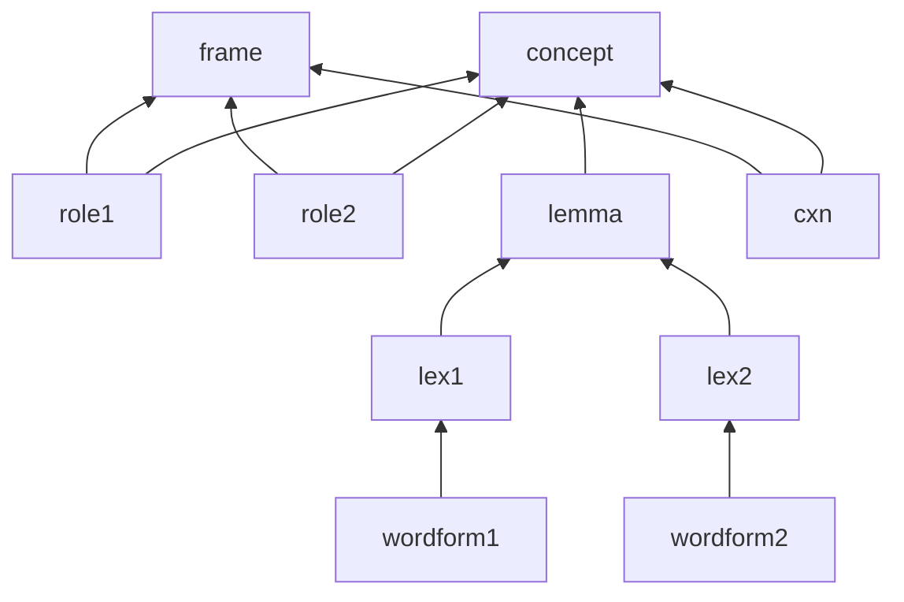

- ROLES são relações qualia (agentive, telic, constitutive, formal) detalhadas
- Relações entre CONCEPTS são dão via ROLES
- O filler de uma ROLE pode ser específico do CONCEPT ou pode ser mais geral.
- FRAMES são generalizações de CONCEPTS que possuem a "mesma" estrutura.
- A maior parte do conhecimento/significado deve ser inferido e não modelado explicitamente.
- CONCEPTS evocados por uma sentença/imagem constroem uma "cena dinâmica".
- Diferenciar Attribute do valor do Attribute.
- Construções são vistas como "lemma complexos" e são associadas a FRAMES ou CONCEPTS.
- As ROLES (relações qualia) carregam parte do significado da cena.
