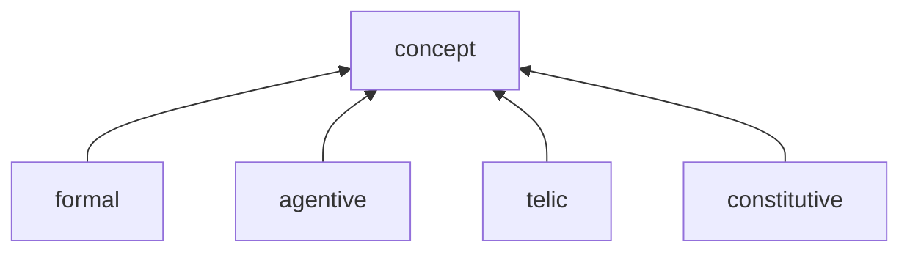

- Roles são relações qualia mais detalhadas.
- Para entidades, especificam atributos. 
- Para eventos, especificam argumentos.
- Para relações, especificam o papel de cada elemento da relação.
- Fundamental: a lista de ROLES é "aberta", no sentido de que novas ROLES podem ser acrescentadas para especificar o significado de um CONCEPT. Uma nova ROLE, no entanto, precisa ser classificada de acordo com seu qualia.

## Formal
- Type
- Instance

- A diferença entre os dois é similar à diferença entre _intension_ e _extension_ em lógica.
- TYPE: o CONCEPT1 define um "tipo" mais específico que o CONCEPT2.  Ambos tem o mesmo "tipo ontológico", mas o CONCEPT1 se diferencia por características e relações específicas (que devem ser formalizadas através de ROLES distintas, ou fillers mais específicos por exemplo). Esta é uma definição intensional.
    - Ex: restaurante TYPE construção
    - No exemplo, restaurante é um novo tipo, pois acrescenta uma funcionalidade (qualia télico) a uma construção.
- INSTANCE: o CONCEPT1 pode ser visto como fazendo parte da extensão de CONCEPT2 (ou seja, como um exemplar ou instância de CONCEPT2). O CONCEPT1 tem características que exemplificam/instanciam/especificam uma característica já definida no CONCEPT2. Ambos tem o mesmo "tipo ontológico".
    - Ex: restaurante japonês INSTANCE restaurante
    - No exemplo, a comida servida pelo restaurante é caracterizada como “japonesa”, que é um exemplo de comida. Mas a definição não muda a natureza ontológica do CONCEPT1, que continua sendo um restaurante.

## Agentive

- Agent
- Cause
- Start
- Origin
- Source
- Donor

##  Telic

- Function
- Intention
- Purpose
- Goal
- Result
- Destination
- Receiver

## Constitutive

- Part
- Component
- Member
- Material
- Quality
- Property
- Attribute
- Instrument
- State
- Participant
- Undergoer
- Beneficiary